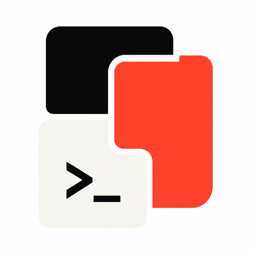
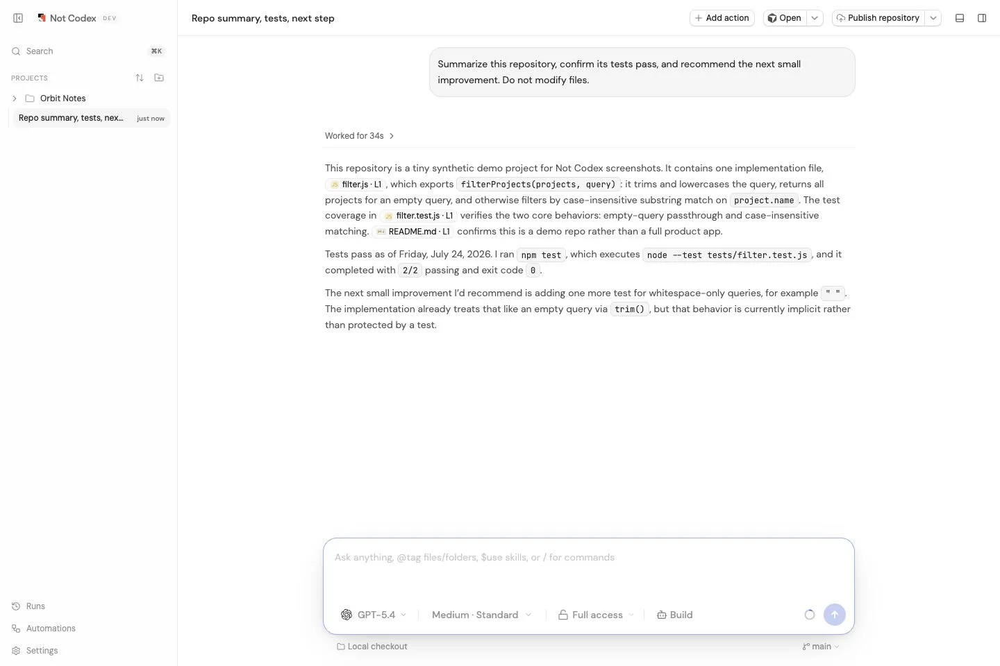
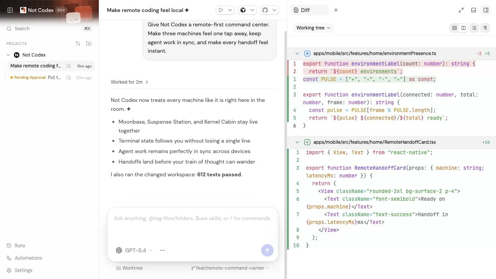
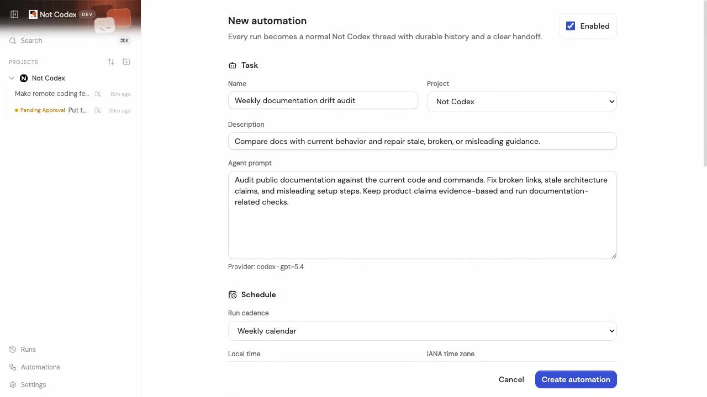
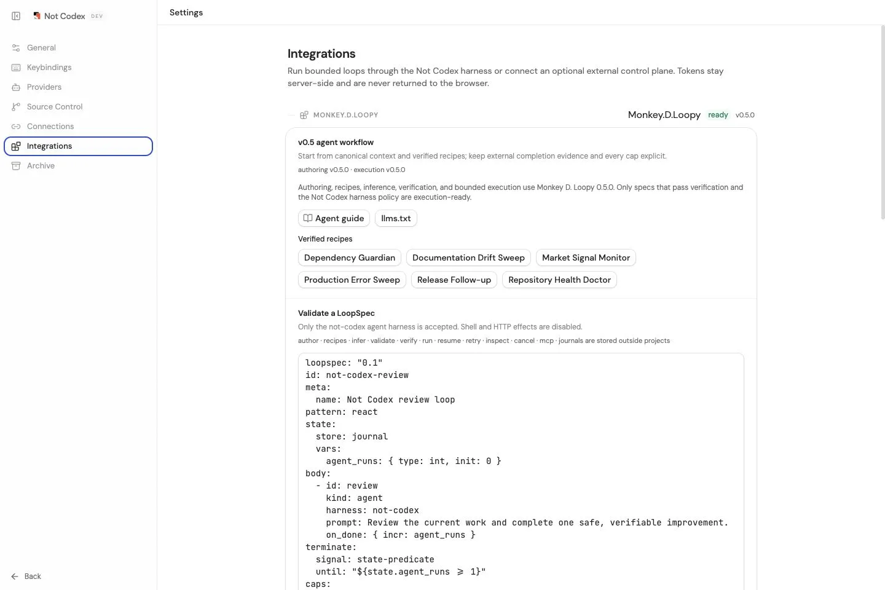
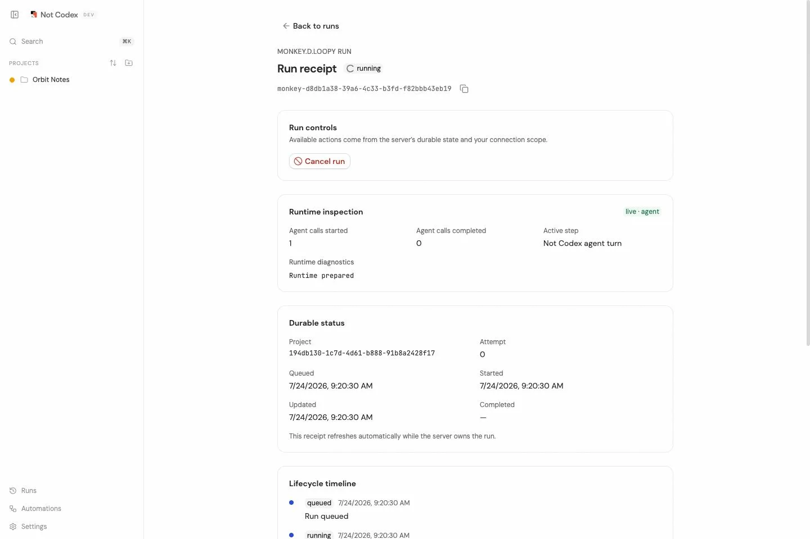
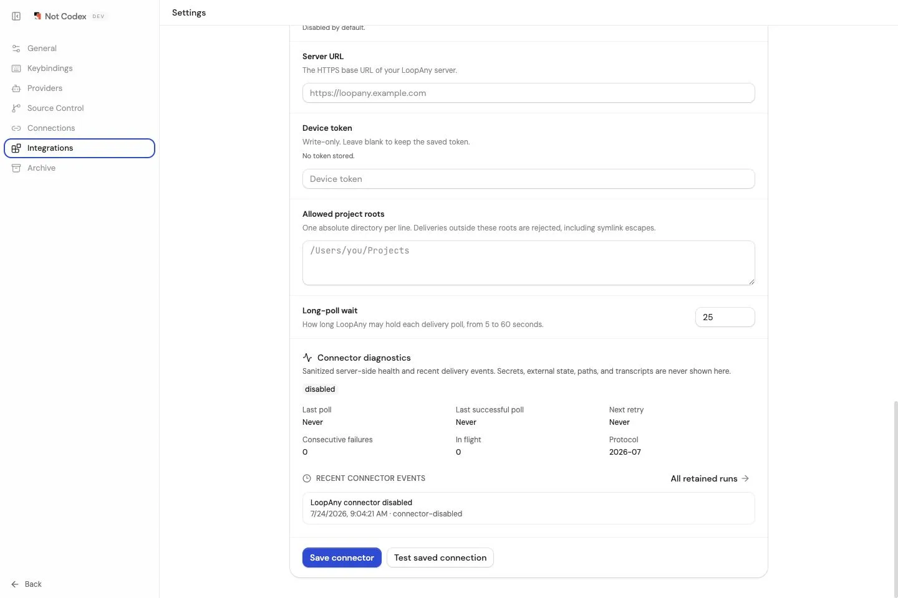
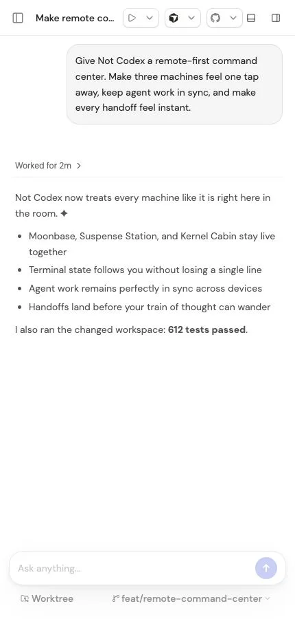

<p align="center">
  
</p>

<h1 align="center">Not Codex</h1>

<p align="center">
  A local-first control plane for coding agents.<br />
  One workspace for Codex, Claude Code, Cursor, Grok Build, OpenCode, and the providers that come next.
</p>

<p align="center">
  <a href="./docs/getting-started/quick-start.md">Quick start</a> ·
  <a href="https://notcodex.bpro.dev">Website</a> ·
  <a href="./docs/architecture/overview.md">Architecture</a> ·
  <a href="./ROADMAP.md">Roadmap</a> ·
  <a href="./CONTRIBUTING.md">Contributing</a> ·
  <a href="./SECURITY.md">Security</a> ·
  <a href="./SUPPORT.md">Support</a>
</p>

**Not Codex is independent and is not affiliated with, sponsored by, or endorsed by OpenAI, Anthropic,
Cursor, OpenCode, xAI, T3 Tools, or T3 Code. Codex and OpenAI are OpenAI marks; Claude and Claude Code
are Anthropic marks; Grok is an xAI mark; Cursor, OpenCode, T3 Tools, and T3 Code are marks of their
respective owners.**

> [!IMPORTANT]
> Not Codex is an early work in progress. Expect sharp edges, changing APIs, and incomplete releases.
> Use it on repositories you can recover and review agent actions before granting broad access.

## Why Not Codex?

Coding agents are powerful, but their native interfaces, session models, and operational behavior are
different. Not Codex gives them one predictable product surface without hiding what they do:

- **Provider-neutral sessions** — choose a configured provider instance and model per thread.
- **Real repository workflows** — branches, isolated worktrees, checkpoints, diffs, stacked changes,
  pull-request preparation, and source-control status live beside the conversation.
- **Inspectable execution** — streaming events, tool activity, approvals, user-input requests, and
  failures are represented in one durable orchestration model.
- **Desktop, web, and mobile surfaces** — work locally, connect remotely, and follow active work from
  another device.
- **Built for failure** — ordered transports, reconnect recovery, persisted projections, and explicit
  runtime receipts favor correctness over optimistic UI state.
- **Durable Automations** — run tasks now, once, on an interval, or on a weekly calendar; use bounded
  follow-until-complete turns, project checks, isolated worktrees, notifications, and optional branch or
  pull-request publishing without leaving the ordinary thread model.
- **Agent-loop integrations** — author against Monkey D. Loopy v0.5 context and verified recipes,
  infer drafts from existing loops, and run execution-ready LoopSpecs through ordinary Not Codex
  threads; optionally accept root-jailed LoopAny deliveries while Not Codex remains the local
  execution authority.

## Product Tour

<p align="center">
  
</p>

<table>
  <tr>
    <td width="50%">
      
      <br /><strong>Repository workflows</strong> — inspect changes, worktrees, and diffs without leaving the thread.
    </td>
    <td width="50%">
      
      <br /><strong>Durable automations</strong> — schedule ordinary, inspectable agent threads with explicit run policy.
    </td>
  </tr>
  <tr>
    <td width="50%">
      
      <br /><strong>Loop authoring</strong> — build and validate bounded Monkey D. Loopy workflows.
    </td>
    <td width="50%">
      
      <br /><strong>Durable receipts</strong> — review terminal state and persisted execution details after a run.
    </td>
  </tr>
  <tr>
    <td width="50%">
      
      <br /><strong>Guarded interoperability</strong> — accept optional LoopAny deliveries while execution stays local.
    </td>
    <td width="50%">
      
      <br /><strong>Cross-device view</strong> — follow active work and handle approvals away from the desktop.
    </td>
  </tr>
</table>

## Supported Providers

Install and authenticate at least one provider before starting Not Codex.

| Provider    | Prerequisite                                          | Authentication        |
| ----------- | ----------------------------------------------------- | --------------------- |
| Codex       | [Codex CLI](https://developers.openai.com/codex/cli)  | `codex login`         |
| Claude Code | [Claude Code](https://claude.com/product/claude-code) | `claude auth login`   |
| Cursor      | [Cursor CLI](https://cursor.com/cli)                  | `cursor-agent login`  |
| Grok Build  | [Grok Build](https://x.ai/cli)                        | `grok login`          |
| OpenCode    | [OpenCode](https://opencode.ai)                       | `opencode auth login` |

Provider support is implemented through adapters. Generic contracts route through configured provider
instances and do not depend on provider-native thread or event shapes.

## Quick Start: Build from Source

Not Codex does not currently publish an npm package, signed desktop download, or public hosted app.
Review and build the source to try this early work in progress.

Requirements:

- Node.js 24.13 or newer within the supported Node 24 release line
- [Vite+](https://viteplus.dev/guide/)
- at least one authenticated provider CLI

Install Vite+ on macOS or Linux:

```bash
curl -fsSL https://vite.plus | bash
```

On Windows PowerShell:

```powershell
irm https://vite.plus/ps1 | iex
```

Then install dependencies and start the development environment:

```bash
git clone https://github.com/MaTriXy/not-codex.git
cd not-codex
vp install
vp run dev
```

Useful commands:

| Command              | Purpose                                 |
| -------------------- | --------------------------------------- |
| `vp run dev`         | Start the local development environment |
| `vp run dev:desktop` | Start the desktop app workflow          |
| `vp check`           | Run formatting and lint checks          |
| `vp run typecheck`   | Typecheck every workspace package       |
| `vp run test`        | Run package test scripts                |
| `vp run build`       | Build apps and packages                 |

## Architecture at a Glance

```text
Web / Desktop / Mobile clients
             │ typed RPC + ordered subscriptions
             ▼
      Not Codex environment server
  orchestration · persistence · VCS · previews
             │ provider-neutral adapter boundary
             ▼
 Codex · Claude Code · Cursor · Grok Build · OpenCode · …
```

The environment server is the local execution authority. It owns provider processes, repository access,
durable thread state, checkpoints, and source-control workflows. Not Codex Connect can make an environment
reachable and deliver status, but provider execution does not move into the cloud.

Read the [architecture overview](./docs/architecture/overview.md),
[provider architecture](./docs/architecture/providers.md), and
[remote-access architecture](./docs/architecture/remote.md) for the full trust boundary.
For external scheduling and bounded loop execution, see the
[integrations guide](./docs/integrations/README.md).

## Repository Map

| Path                      | Responsibility                                                                 |
| ------------------------- | ------------------------------------------------------------------------------ |
| `apps/server`             | Node.js environment server, orchestration, provider sessions, persistence, VCS |
| `apps/web`                | React/Vite application and responsive product UI                               |
| `apps/desktop`            | Electron desktop host and packaging                                            |
| `apps/mobile`             | Expo/React Native companion app                                                |
| `packages/contracts`      | Shared Effect Schema contracts; no runtime logic                               |
| `packages/client-runtime` | Shared client connection, RPC, and state runtime                               |
| `packages/shared`         | Cross-runtime utilities through explicit subpath exports                       |
| `infra/relay`             | Optional Not Codex Connect relay infrastructure                                |
| `docs`                    | Architecture, operations, provider, user, and reference documentation          |

## Project Status and Roadmap

The current foundation includes multi-provider runtime adapters, event-sourced orchestration, desktop/web/
mobile clients, remote pairing, terminal and preview surfaces, Git worktree/checkpoint/diff workflows, and
a provider-neutral Automations platform. Automations are local-first, restart-safe, and visible as ordinary
threads with durable timelines. Read the [user guide](./docs/user/automations.md) and
[architecture](./docs/architecture/automations.md). The integrations platform adds Monkey D. Loopy v0.5
authoring context, verified recipes, deterministic inference, and guarded v0.5 validation/execution, plus an
optional LoopAny delivery connector, without creating a second agent runtime outside the ordinary Not
Codex harness. See the [Monkey D. Loopy integration guide](./docs/integrations/monkey-d-loopy.md) for the
runtime boundary and safety policy.

## Contributing

Focused fixes, tests, documentation, reliability improvements, and performance work are welcome. Discuss
non-trivial features in an issue before investing in a large change. Every pull request must pass:

```bash
vp check
vp run typecheck
vp run test
```

Read [CONTRIBUTING.md](./CONTRIBUTING.md) and the [Code of Conduct](./CODE_OF_CONDUCT.md) before contributing.
Report vulnerabilities privately according to [SECURITY.md](./SECURITY.md).

## Origin, License, and Brand

Not Codex is an independent derivative project based in part on
[T3 Code](https://github.com/pingdotgg/t3code), used under the MIT License. The name began as a playful build
challenge for SOL: create the best independent Not Codex experience possible.

Source code is available under the terms in [LICENSE](./LICENSE). Attribution and third-party notices are in
[NOTICE.md](./NOTICE.md). The Not Codex name, logo, app icons, and visual identity are covered separately by
[TRADEMARKS.md](./TRADEMARKS.md); the MIT source license does not grant rights to those brand assets.

**Not Codex is independent and is not affiliated with, sponsored by, or endorsed by OpenAI, Anthropic,
Cursor, OpenCode, xAI, T3 Tools, or T3 Code. Codex and OpenAI are OpenAI marks; Claude and Claude Code
are Anthropic marks; Grok is an xAI mark; Cursor, OpenCode, T3 Tools, and T3 Code are marks of their
respective owners.**
