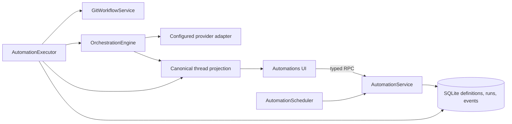

# Automations architecture

Automations are a durable coordination layer over the existing provider-neutral orchestration runtime.
They are not a second agent implementation.

## Boundaries

- `packages/contracts/src/automation.ts` contains schema-only definitions, policies, run records,
  events, and RPC inputs/outputs.
- `packages/shared/src/automationSchedule.ts` contains deterministic schedule arithmetic.
- `apps/server/src/persistence` owns SQLite migration 033 and the automation repository.
- `apps/server/src/automation` owns service validation, due-schedule advancement, execution leases,
  recovery, provider turns, completion checks, retry, and publication.
- `packages/client-runtime` owns environment-scoped query, command, and subscription atoms.
- `apps/web` owns the responsive Automations workspace and notification presentation.

Generic automation code stores `ModelSelection`, `RuntimeMode`, `ProjectId`, `ThreadId`, and `TurnId`.
It does not expose provider-native session identifiers or event payloads.

## Persistence and idempotency

Definitions are mutable. Each run captures an immutable definition snapshot so its behavior stays
explainable after later edits. The database enforces one active run per automation and a unique
scheduled occurrence. Due definitions are advanced transactionally through the service; a conflict is
treated as an already-active occurrence rather than a reason to duplicate work.

The scheduler advances recurring schedules from the current clock after downtime. This implements a
bounded run-latest policy. Interval schedules retain their anchor; calendar schedules search by local
wall-clock minute in the configured IANA zone and avoid running the repeated fall-back slot twice.

## Lease and recovery model

The executor claims a run with a short renewable lease. Queued, retry-wait, and expired in-flight runs
are claimable. The persisted thread and worktree identifiers determine whether recovery resumes known
work or starts a fresh provider-neutral thread.

Automatic retries are deliberately conservative. They apply only after a confirmed terminal provider
failure, failed completion contract, or check failure. Failures whose side effects may be ambiguous—
thread creation, turn dispatch, timeouts, event recording, and branch/PR publication—stop for human
inspection instead of risking duplicate turns or pull requests.

## Execution lifecycle

1. Resolve the persisted project and capture its base revision.
2. Prepare an isolated worktree and deterministic `automation/...` branch when requested.
3. Create a normal orchestration thread with the selected provider/model and runtime mode.
4. Dispatch the prompt through `thread.turn.start` and observe the canonical thread projection.
5. Pause or fail on approval/input according to policy, renewing the lease while waiting.
6. Evaluate turn completion, a bounded goal marker, or selected project scripts.
7. Optionally send bounded follow-up turns on the same thread.
8. Optionally commit/push or create a draft/ready pull request through the existing source-control
   provider abstraction.
9. Persist final revisions, refs, PR URL, outcome, and timeline events.

## Trust boundary

Execution stays in the Not Codex environment server. Connect may transport the same authenticated RPC
and status subscription used by a local client, but it is not a scheduler or provider runtime. Secrets
are not copied into automation contracts or run events. Publishing is opt-in, and ready pull requests
require a literal confirmation in the persisted policy.
