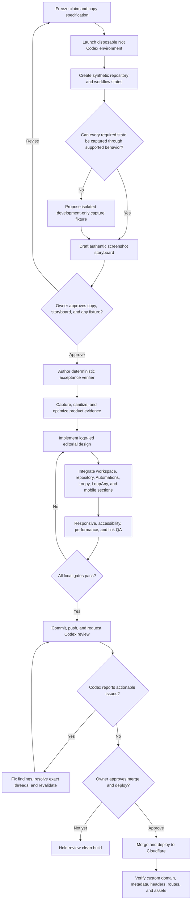
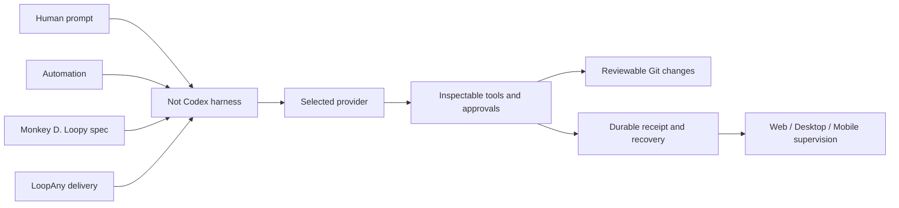

# Not Codex Marketing Site Redesign Flow

```mermaid
flowchart TD
    A["Freeze claim and copy specification"] --> B["Launch disposable Not Codex environment"]
    B --> C["Create synthetic repository and workflow states"]
    C --> D{"Can every required state be captured through supported behavior?"}
    D -- "Yes" --> E["Draft authentic screenshot storyboard"]
    D -- "No" --> F["Propose isolated development-only capture fixture"]
    F --> E
    E --> G{"Owner approves copy, storyboard, and any fixture?"}
    G -- "Revise" --> A
    G -- "Approve" --> H["Author deterministic acceptance verifier"]
    H --> I["Capture, sanitize, and optimize product evidence"]
    I --> J["Implement logo-led editorial design"]
    J --> K["Integrate workspace, repository, Automations, Loopy, LoopAny, and mobile sections"]
    K --> L["Responsive, accessibility, performance, and link QA"]
    L --> M{"All local gates pass?"}
    M -- "No" --> J
    M -- "Yes" --> N["Commit, push, and request Codex review"]
    N --> O{"Codex reports actionable issues?"}
    O -- "Yes" --> P["Fix findings, resolve exact threads, and revalidate"]
    P --> N
    O -- "No" --> Q{"Owner approves merge and deploy?"}
    Q -- "Not yet" --> R["Hold review-clean build"]
    Q -- "Approve" --> S["Merge and deploy to Cloudflare"]
    S --> T["Verify custom domain, metadata, headers, routes, and assets"]
```

## Product story rendered by the homepage

```mermaid
flowchart LR
    H["Human prompt"] --> N["Not Codex harness"]
    A["Automation"] --> N
    M["Monkey D. Loopy spec"] --> N
    L["LoopAny delivery"] --> N
    N --> P["Selected provider"]
    P --> X["Inspectable tools and approvals"]
    X --> G["Reviewable Git changes"]
    X --> D["Durable receipt and recovery"]
    D --> W["Web / Desktop / Mobile supervision"]
```
